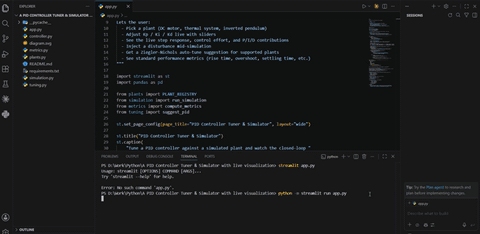

# PID Controller Tuner & Simulator

[](https://github.com/Saeedam02/PID-controller-tuner-simulator/actions/workflows/ci.yml)


An interactive **control-engineering sandbox** for understanding, tuning, and
validating PID controllers against simulated physical systems. The project
combines a Streamlit interface with a reusable Python package, automated tests,
headless CLI runs, actuator saturation, anti-windup, derivative filtering,
disturbance experiments, sensor noise, performance metrics, and explainable
open-loop model identification.

<p align="center">
  
</p>

> **Scope:** this is an educational/research portfolio simulator. The included
> models and tuning rules are deliberately inspectable approximations, not
> hardware certification or safety-critical controller validation.

---

## Why this repository exists

A PID demo can easily become "three sliders and a chart." This project is built
to expose the parts that matter in actual digital control code:

- **derivative on measurement** to reduce set-point derivative kick;
- **first-order derivative filtering** to limit high-frequency amplification;
- **actuator saturation** with plant-specific default limits;
- **conditional-integration anti-windup** rather than unconditional integral freezing;
- **disturbance rejection** using impulse, pulse, or step disturbances;
- **sensor experiments** with seeded Gaussian noise and optional low-pass filtering;
- **standard tracking metrics** plus integral-error and control-effort metrics;
- **open-loop FOPDT identification** with explicit assumption checks;
- **lambda-tuned PI** as a conservative model-based starting point;
- **Ziegler-Nichols reaction-curve PID** only when the identified dead time is meaningful;
- **automated tests and CI** so numerical/control behavior is checked continuously.

---

## Architecture

<p align="center">
  
</p>

The repository uses a conventional `src/` layout. Streamlit is only the
presentation layer; the controller, models, simulation, metrics, tuning, and
exports are reusable independently.

```text
PID-controller-tuner-simulator/
├── .github/
│   └── workflows/
│       └── ci.yml
├── .streamlit/
│   └── config.toml
├── assets/
│   ├── Animation.gif
│   └── diagram.svg
├── docs/
│   ├── ARCHITECTURE.md
│   └── MATHEMATICS.md
├── examples/
│   └── basic_simulation.py
├── src/
│   └── pid_tuner/
│       ├── __init__.py
│       ├── cli.py
│       ├── controller.py
│       ├── export.py
│       ├── metrics.py
│       ├── plants.py
│       ├── simulation.py
│       └── tuning.py
├── tests/
│   ├── conftest.py
│   ├── test_cli.py
│   ├── test_controller.py
│   ├── test_export.py
│   ├── test_metrics.py
│   ├── test_plants.py
│   ├── test_simulation.py
│   └── test_tuning.py
├── app.py
├── CHANGELOG.md
├── CITATION.cff
├── CONTRIBUTING.md
├── LICENSE
├── MIGRATION.md
├── pyproject.toml
├── README.md
├── requirements.txt
└── ROADMAP.md
```

See [`docs/ARCHITECTURE.md`](docs/ARCHITECTURE.md) for module responsibilities.

---

## Plant models

### 1. DC motor speed

A first-order electromechanical approximation with electrical dynamics omitted:

$$
J\dot{\omega}=K_tu-b\omega-T_{load}-d.
$$

It is fast, stable, and useful for understanding saturation, rise time, integral
action, and load-torque rejection.

### 2. Thermal process

A first-order heater/process model:

$$
\tau\dot T=-(T-T_a)+Ku+d.
$$

Its slow dynamics make integral action and windup especially visible.

### 3. Inverted pendulum

A simplified linearized angle model:

$$
\ddot\theta=\frac{g}{L}\theta+\frac{u}{ML}+\frac{d}{ML}.
$$

The upright equilibrium is open-loop unstable. That is intentional: it is a
useful benchmark for stabilization and demonstrates why a stable open-loop
reaction-curve tuning procedure must not simply be applied to every plant.

---

## PID implementation

The controller uses the parallel form

$$
u=K_pe+K_i\int e\,dt-K_d\dot y_f,
$$

where the derivative is taken on the measurement rather than the error.

### Conditional anti-windup

Version 2 implements **true conditional integration**. A proposed integral
update is rejected only when the actuator is saturated and the update would push
the command farther into the active saturation limit. If the integral increment
helps the controller return toward the unsaturated region, integration is
allowed.

This corrects the common simplistic behavior of freezing the integrator for
every saturated sample regardless of direction.

### Derivative filtering

The raw measurement derivative is passed through a first-order low-pass filter:

$$
\alpha=\frac{\Delta t}{\tau_f+\Delta t}.
$$

Setting the filter time constant to zero disables filtering.

More detail is in [`docs/MATHEMATICS.md`](docs/MATHEMATICS.md).

---

## Auto-tuning and system identification

The simulator first fits a first-order-plus-dead-time model

$$
G(s)=\frac{K e^{-Ls}}{\tau s+1}
$$

using a 28.3%/63.2% two-point reaction-curve estimate.

The identification pipeline now checks whether the plant explicitly supports a
stable open-loop step test and whether the simulated response actually settles
into a usable FOPDT shape.

### Lambda-tuned PI

The default auto-tuning option is a conservative model-based PI starting point:

$$
K_p=\frac{\tau}{K(\lambda+L)},\qquad
K_i=\frac{K_p}{\tau},\qquad K_d=0.
$$

It remains well defined when the fitted dead time is small.

### Ziegler-Nichols reaction-curve PID

The classic relation

$$
K_p=\frac{1.2\tau}{KL},\qquad T_i=2L,\qquad T_d=0.5L
$$

contains $1/L$. Instead of quietly substituting an arbitrary epsilon when
$L\approx0$, this implementation reports that the Ziegler-Nichols rule is
ill-conditioned. That makes the limitation visible rather than producing a
misleading set of huge gains.

Likewise, the inverted pendulum is rejected explicitly because it is open-loop
unstable.

---

## Performance metrics

The simulator reports:

- 10-90% rise time where that definition is meaningful;
- percent overshoot;
- ±2% settling time;
- steady-state error;
- IAE — integral absolute error;
- ISE — integral squared error;
- ITAE — integral time-weighted absolute error;
- RMS tracking error;
- peak absolute tracking error;
- RMS control effort;
- control total variation; and
- actuator saturation fraction.

The metric implementation accounts for negative steps, non-zero initial output,
and zero-target stabilization rather than assuming every experiment starts at
zero and steps to a positive reference.

---

## Quick start

### Option A — recommended development install

```bash
git clone https://github.com/Saeedam02/PID-controller-tuner-simulator.git
cd PID-controller-tuner-simulator

python -m venv .venv
```

Activate the environment:

```bash
# Windows
.venv\Scripts\activate

# macOS/Linux
source .venv/bin/activate
```

Then install and run:

```bash
python -m pip install -e ".[dev]"
streamlit run app.py
```

### Option B — runtime dependencies only

```bash
python -m pip install -r requirements.txt
streamlit run app.py
```

---

## Using the app

1. Choose a plant.
2. Inspect its model description and equation.
3. Start with the checked-in default gains or run the identification-based tuner.
4. Adjust `Kp`, `Ki`, and `Kd` manually.
5. Change the derivative-filter time constant or disable anti-windup to compare behavior.
6. Add measurement noise and optionally low-pass-filter the controller measurement.
7. Inject an impulse, pulse, or step disturbance.
8. Inspect response, control effort, P/I/D terms, and metrics.
9. Export the full time history as CSV and the configuration/metrics as JSON.

The app records **true plant output** separately from the **measurement seen by
the controller**, which is important when studying sensor noise.

---

## Command-line use

After an editable install, the package exposes a headless command:

```bash
pid-tuner-sim --plant dc_motor
```

Example with noise and CSV export:

```bash
pid-tuner-sim \
  --plant thermal \
  --duration 60 \
  --noise-std 0.2 \
  --measurement-filter-tau 0.5 \
  --csv results/thermal.csv
```

Request a model-based starting tune:

```bash
pid-tuner-sim --plant thermal --auto-tune lambda_pi
```

This makes results reproducible without clicking through the UI and is useful
for CI, experiments, and future benchmark scripts.

---

## Programmatic use

```python
from pid_tuner.metrics import compute_metrics
from pid_tuner.plants import DCMotorSpeed
from pid_tuner.simulation import run_simulation

plant = DCMotorSpeed()
results = run_simulation(
    plant,
    kp=0.8,
    ki=4.0,
    kd=0.02,
    setpoint=100.0,
    duration=5.0,
    dt=0.02,
)

metrics = compute_metrics(
    results["t"],
    results["setpoint"],
    results["output"],
    control=results["control"],
    saturated=results["saturated"],
)

print(metrics)
```

A runnable version is included in [`examples/basic_simulation.py`](examples/basic_simulation.py).

---

## Testing and quality checks

Install the development dependencies:

```bash
python -m pip install -e ".[dev]"
```

Then run:

```bash
ruff check .
black --check .
pytest --cov=pid_tuner --cov-branch --cov-report=term-missing
```

The project enforces at least **90% branch-aware core-package coverage** through
its coverage configuration. The prepared v2 bundle was validated locally with
**60 passing tests and 96.55% total branch-aware coverage** on Python 3.13.5.
GitHub Actions runs the suite on Python 3.10-3.13.

The tests cover controller saturation/anti-windup, derivative behavior, RK4,
plant dynamics, disturbance profiles, deterministic sensor noise, metrics,
FOPDT identification, tuning-assumption rejection, exports, and CLI smoke runs.

---

## What changed from the original version?

The original repository had a useful modular prototype, but the Python modules
and images all lived at the repository root and there was no automated test
suite. Version 2 keeps the underlying educational idea while making the project
closer to research-quality software:

- standard `src/` package layout;
- corrected README cloning instructions;
- extensive comments/docstrings and mathematical notes;
- explicit plant/tuning assumptions;
- corrected conditional anti-windup behavior;
- richer metrics;
- realistic actuator limits;
- noise and measurement-filter experiments;
- more useful disturbances;
- CSV/JSON exports;
- CLI support;
- tests, coverage, linting, formatting, and CI;
- citation metadata and changelog.

If you are upgrading an existing clone, read [`MIGRATION.md`](MIGRATION.md).

---

## Current limitations

- The plant models are intentionally simplified.
- The DC motor omits electrical inductance and back-EMF dynamics.
- The inverted-pendulum model controls angle only and is not a full cart-pendulum model.
- The measurement filter is a simple first-order low-pass, **not a Kalman filter**.
- The current stable plants contain little/no physical transport delay, so the
  Ziegler-Nichols reaction-curve PID rule may correctly report that it is not suitable.
- No controller in this repository is certified for physical or safety-critical hardware.

These limitations are documented rather than hidden because they define the
next technically meaningful development steps.

---

## Roadmap

The next major improvements are described in [`ROADMAP.md`](ROADMAP.md), including:

- full state-space cart-pendulum model + LQR comparison;
- plant-specific Kalman filters with explicit noise models;
- higher-fidelity DC motor electromechanics;
- a genuine dead-time process benchmark for reaction-curve tuning;
- MIMO/coupled-tank work with an appropriate multivariable control architecture;
- reproducible controller benchmark reports.

---

## License

MIT License. See [`LICENSE`](LICENSE).
